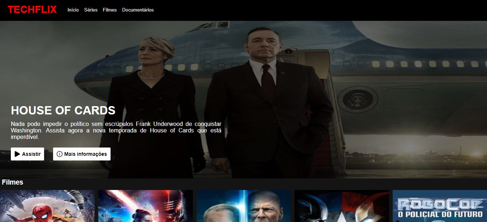
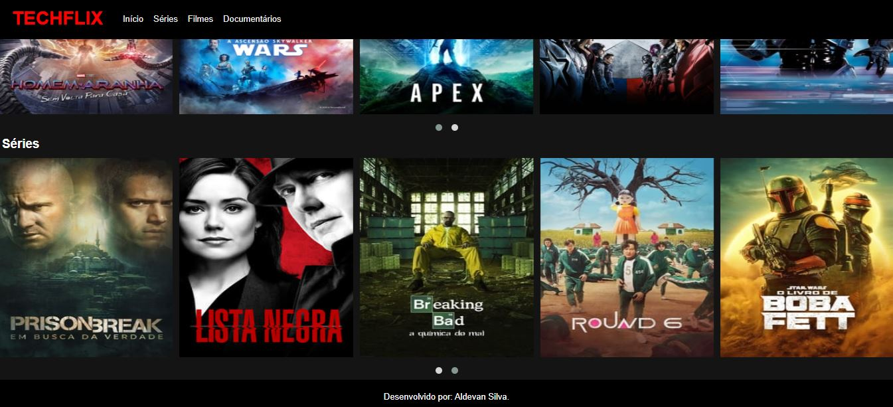

# Interface da Netflix
Esse projeto tem como objetivo apresentar uma releitura da interface da Netflix.

### Recursos utilizados: ###
- Imagem de capa: [TMDB](https://www.themoviedb.org/?language=pt-BR)
- Biblioteca Jquery: [Owl Carousel 2](https://owlcarousel2.github.io/OwlCarousel2/)

**Capturas de tela:**

**Redes sociais:**

| 
----------|----------
